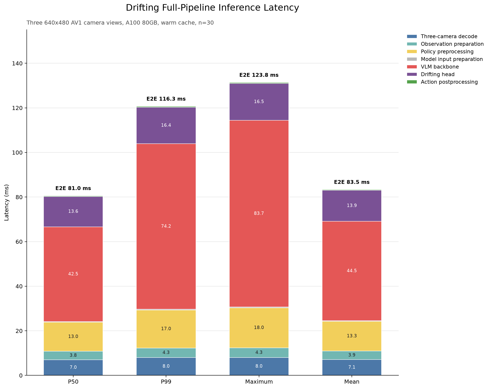

# Drifting Policy

Drifting is an experimental vision-language-action policy based on NVIDIA GR00T N1.7. It keeps the GR00T N1.7 Cosmos-Reason2/Qwen3-VL backbone, multi-embodiment inputs, and preprocessing pipeline, but replaces the flow-matching DiT action generator with an Implicit Drifting action head.

The main practical difference is action generation latency: the standard GR00T N1.7 head iteratively refines an action chunk, while Drifting predicts the complete chunk with exactly one action-head network evaluation at deployment time.

> [!IMPORTANT]
> Drifting does not reuse the pretrained GR00T flow-matching action-head weights. The new action head is initialized separately and must be trained on robot demonstrations before it can be used for control. `base_model_path` provides the GR00T N1.7 processor assets and model metadata; it is not a pretrained Drifting checkpoint.

## Model Overview

Drifting accepts the same modalities as the LeRobot GR00T N1.7 integration:

- One or more camera observations.
- A natural-language task instruction.
- The robot state.
- An embodiment identifier, which selects embodiment-specific state and action projections.

The policy produces a chunk of continuous robot actions. State and action vectors smaller than the configured maximum dimensions are padded by the GR00T processor and restored to the dataset dimensions after prediction.

The model has two main parts:

1. **Vision-language backbone:** the pretrained `nvidia/Cosmos-Reason2-2B` backbone encodes images and the task instruction. Drifting uses the hidden representation selected by `select_layer` and projects it into the action model dimension.
2. **Drifting action head:** embodiment-specific encoders convert the current state and an action seed into tokens. A conditional transformer processes the state and action tokens while cross-attending to image and text features. An embodiment-specific decoder maps the result to an action chunk.

By default, every second transformer block attends to text tokens and the remaining blocks attend to image tokens. If one of those token groups is absent, the block falls back to all valid backbone tokens.

### One-Step Action Generation

At deployment time, Drifting constructs a zero-valued action seed at time $t=0$ and performs one conditional transformer evaluation:

$$
\hat{\mathbf{a}} = f_\theta(\mathbf{0}, 0 \mid \mathbf{o}),
$$

where $\mathbf{o}$ contains the vision-language features, robot state, and embodiment. The decoded output $\hat{\mathbf{a}}$ is the full predicted action chunk. There is no iterative denoising or flow integration in the inference path.

### Training Objective

Training uses two predictions even though deployment uses only one:

- A **proposal prediction** starts from the same zero action seed used for deployment.
- A **proximal prediction** starts near the demonstrated action at `proximal_time`:

$$
\mathbf{a}_{\mathrm{prox}} = \mathbf{a} + (1 - t_p)\boldsymbol{\epsilon},
\qquad \boldsymbol{\epsilon} \sim \mathcal{N}(0, I).
$$

Both predictions are trained with a masked, geometry-weighted squared potential. For a prediction $\hat{\mathbf{a}}$, target $\mathbf{a}$, action mask $\mathbf{m}$, and detached local geometry excess $\mathbf{g}$, the implementation computes:

$$
\mathcal{L}_{\mathrm{potential}} =
\frac{\sum \frac{1}{2}(1 + \mathbf{g})
(\hat{\mathbf{a}} - \mathbf{a})^2 \mathbf{m}}
{\sum \mathbf{m}}.
$$

The complete objective is:

$$
\mathcal{L} = \mathcal{L}_{\mathrm{proposal}}
+ \lambda_{\mathrm{prox}}\mathcal{L}_{\mathrm{proximal}}.
$$

The geometry excess is computed from similarities between detached observation embeddings and the local variation of demonstrated actions. It reweights action coordinates during training but does not receive gradients itself.

## Drifting Compared with GR00T N1.7

| Component                            | GR00T N1.7                       | Drifting                         |
| ------------------------------------ | -------------------------------- | -------------------------------- |
| Vision-language backbone             | Cosmos-Reason2/Qwen3-VL          | Same backbone                    |
| Preprocessing                        | GR00T N1.7 processors            | Same processors                  |
| Action generator                     | Flow-matching DiT                | Conditional Drifting transformer |
| Action-head evaluations at inference | Configurable, typically multiple | Exactly one                      |
| Pretrained action-head weights       | Loaded from a GR00T checkpoint   | Must be trained separately       |
| Native RTC overlap guidance          | Supported                        | Not supported                    |

## Installation

Drifting uses the GR00T dependencies and is intended for NVIDIA GPU-accelerated systems. Install LeRobot with the GR00T and training extras:

```bash
pip install -e ".[groot,training]"
```

For an installed LeRobot release, use:

```bash
pip install "lerobot[groot,training]"
```

Authenticate before downloading the GR00T N1.7 assets or pushing checkpoints:

```bash
hf auth login
wandb login
```

## Training

Select the policy with `--policy.type=drifting`. The following example trains a new embodiment from a LeRobot dataset:

```bash
export DATASET=your_hf_username/your_dataset
export REPO_ID=your_hf_username/your_drifting_checkpoint
export OUTPUT_DIR=outputs/train/drifting

lerobot-train \
  --dataset.repo_id=$DATASET \
  --dataset.image_transforms.enable=true \
  --policy.type=drifting \
  --policy.base_model_path=nvidia/GR00T-N1.7-3B \
  --policy.embodiment_tag=new_embodiment \
  --policy.device=cuda \
  --policy.chunk_size=16 \
  --policy.n_action_steps=16 \
  --policy.use_relative_actions=true \
  --policy.relative_exclude_joints='["gripper"]' \
  --policy.use_bf16=true \
  --policy.push_to_hub=true \
  --policy.repo_id=$REPO_ID \
  --batch_size=64 \
  --steps=20000 \
  --save_checkpoint=true \
  --save_freq=5000 \
  --use_policy_training_preset=true \
  --output_dir=$OUTPUT_DIR \
  --job_name=drifting \
  --wandb.enable=true
```

Choose `embodiment_tag`, action representation, chunk size, batch size, and training duration for your dataset and robot. In particular, `new_embodiment` is appropriate when the embodiment is not already represented by the GR00T processor metadata.

The default training setup freezes the language and vision towers while training the new action model, embodiment-specific projections, and vision-language projection. The most relevant controls are:

| Option                | Default | Purpose                                                                     |
| --------------------- | ------: | --------------------------------------------------------------------------- |
| `tune_action_model`   |  `true` | Train the conditional transformer.                                          |
| `tune_projector`      |  `true` | Train state/action encoders, the action decoder, and positional embeddings. |
| `tune_vlln`           |  `true` | Train the vision-language normalization and projection layers.              |
| `tune_llm`            | `false` | Fine-tune the full language model.                                          |
| `tune_visual`         | `false` | Fine-tune the vision tower.                                                 |
| `tune_top_llm_layers` |     `0` | Fine-tune only the final language-model layers.                             |

## Inference

Load a trained Drifting checkpoint through the standard LeRobot policy interface:

```bash
export MODEL_ID=your_hf_username/your_drifting_checkpoint

lerobot-eval \
  --policy.path=$MODEL_ID \
  --env.type=libero \
  --env.task=libero_spatial \
  --eval.n_episodes=50
```

The example assumes the checkpoint was trained for the selected LIBERO embodiment and task distribution. For a real robot, pass the same checkpoint to [`lerobot-rollout`](./inference) with the robot, cameras, and task instruction used by your setup.

> [!WARNING]
> Drifting currently rejects native Real-Time Chunking (RTC) overlap guidance. Disable RTC for rollout instead of supplying a previous action-chunk prefix.

### Measured Inference Latency

The following offline benchmark was collected on 2026-07-24 with an NVIDIA A100-SXM4-80GB, PyTorch `2.11.0+cu128`, BF16 autocast, and the `drifting_siemens_0722` checkpoint. It used three fixed frames from episodes 0, 98, and 195 of the `siemens-v3-disturb` dataset. Each frame contains three 640x480 AV1 camera views. Model kernels and the three TorchCodec decoder entries were warmed before each fixed frame was measured 10 times, for 30 samples total.

| Stage                       | P50 (ms) | P99 (ms) | Maximum (ms) | Mean (ms) |
| --------------------------- | -------: | -------: | -----------: | --------: |
| Three-camera video decode   |    6.977 |    8.001 |        8.025 |     7.080 |
| Observation preparation     |    3.827 |    4.301 |        4.325 |     3.851 |
| Policy preprocessing        |   13.016 |   17.004 |       17.956 |    13.319 |
| Model input preparation     |    0.285 |    0.382 |        0.389 |     0.290 |
| VLM backbone                |   42.549 |   74.196 |       83.696 |    44.544 |
| Drifting action head        |   13.608 |   16.383 |       16.545 |    13.943 |
| Action postprocessing       |    0.316 |    0.414 |        0.437 |     0.320 |
| **End-to-end action chunk** | **81.033** | **116.262** | **123.771** | **83.486** |



The colored segments are independently calculated component statistics. Their P99 and maximum values do not necessarily occur in the same sample, so the black end-to-end markers are the authoritative full-pipeline measurements for those columns.

The median model time is dominated by the VLM rather than the one-step action head:

$$
T_{\mathrm{model}} \approx T_{\mathrm{VLM}} + T_{\mathrm{Drifting}}
= 42.549 + 13.608
= 56.157\ \mathrm{ms}.
$$

With `chunk_size=40` and `n_action_steps=40`, a synchronous `select_action` call took `62.917 ms` to generate the first chunk. The following 39 queue hits had a P50 of `1.361 ms`, and generating the next chunk took `58.958 ms`. At 30 FPS, synchronous rollout can therefore pause for more than the `33.3 ms` frame budget approximately every $40 / 30 = 1.33$ seconds, even though the Drifting head itself is fast.

This benchmark reads local MP4 files to provide repeatable inputs. A live Tron2 bridge does not use TorchCodec or these files, so the video-decode result does not measure bridge networking, camera-state synchronization, image conversion, or observation timeouts. For deployment, asynchronous chunk prefetch without RTC overlap guidance is a more direct way to remove synchronous queue-refill stalls. Native RTC is only needed if overlapping old and new chunks must be blended or inpainted.

The complete methodology, queue measurements, interpretation, and reproduction command are in [`0724inference_analysis.md`](../../0724inference_analysis.md).

## Important Configuration

| Option                       |                    Default | Description                                                         |
| ---------------------------- | -------------------------: | ------------------------------------------------------------------- |
| `backbone_model_name`        | `nvidia/Cosmos-Reason2-2B` | The only backbone currently supported.                              |
| `select_layer`               |                       `16` | Backbone hidden layer used by the action head.                      |
| `action_model_dim`           |                     `1024` | Drifting transformer token dimension.                               |
| `action_model_num_layers`    |                       `12` | Number of transformer blocks.                                       |
| `action_model_num_heads`     |                       `16` | Attention heads per block.                                          |
| `action_model_ff_dim`        |                     `4096` | Feed-forward hidden dimension.                                      |
| `attend_text_every_n_blocks` |                        `2` | Frequency of text cross-attention blocks.                           |
| `proximal_time`              |                      `0.9` | Time used to construct the proximal training seed.                  |
| `proximal_loss_weight`       |                     `81.0` | Weight $\lambda_{\mathrm{prox}}$ in the training objective.         |
| `state_dropout_prob`         |                      `0.2` | Probability of dropping encoded state conditioning during training. |
| `num_inference_timesteps`    |                        `1` | Fixed to one; other values are rejected.                            |

The inherited defaults use an action chunk size of 40, one state observation, maximum state and action dimensions of 132, and up to 32 embodiments. `max_seq_len` must be at least as large as `chunk_size`.

## Current Limitations

- Only the `nvidia/Cosmos-Reason2-2B` backbone is supported.
- The state history length is currently fixed to one observation by default and must match the preprocessed state tensor.
- Native RTC overlap guidance is not implemented.
- The Drifting head cannot be initialized from GR00T N1.7 DiT weights; train and evaluate a Drifting checkpoint before deployment.
- Performance depends on the training dataset and embodiment. Report task success over enough evaluation episodes rather than assuming GR00T N1.7 benchmark results transfer to the new action head.

## Related Resources

- [GR00T policy documentation](./groot)
- [GR00T N1 technical report](https://arxiv.org/abs/2503.14734)
- [NVIDIA GR00T N1.7 model card](https://huggingface.co/nvidia/GR00T-N1.7-3B)
- [Policy deployment](./inference)

GR00T N1.7 assets are released under the [NVIDIA Open Model License Agreement](https://www.nvidia.com/en-us/agreements/enterprise-software/nvidia-open-model-license/). Check the licenses of the base model, training data, and resulting checkpoint before redistribution.
